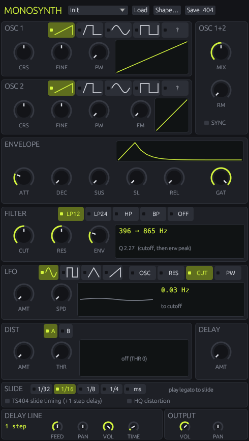

# MonoSynth

A bass and lead synth plugin (VST3 and CLAP, for Windows, macOS and Linux) that sounds exactly like the **TS404**, the classic acid bass synth from early FruityLoops. It can be the TS404 of **FruityLoops 2.71**, **FL 3.5** or **FL 6**.



Overlapping notes glide into each other, and a resonant filter is swept by the envelope. That's the squelchy 303-style sound the TS404 was made for, but it does fat basses, sync leads, bells and wobbles too.

## Versions

The **2.71 / 3.5 / 6** switch at the top picks which FL's TS404 MonoSynth is. Choosing a preset switches to its version.

- **FL 2.71**: the original TS404. It plays one note at a time, with its own delay line.
- **FL 3.5** and **FL 6**: the TS404 as a channel in FL. The synth is the same, but these versions add FL's channel settings: mono and portamento, a gate, echo delay, an arpeggiator and keyboard tracking. The TS404 itself still sounds one note at a time.
  - Cutoff, resonance and the gate belong to the channel here (the CUT, RES and GAT knobs). The rest of the channel settings are under (or beside) the panel.
  - FL 6 also has smoother glides, a different filter ramp, its own volume curve and HQ distortion.

## Installing

Download the zip for your system from [Latest release](../../releases/latest) and copy the plugin into your plugin folder:

| System | VST3 | CLAP |
|---|---|---|
| Windows | `C:\Program Files\Common Files\VST3` | `C:\Program Files\Common Files\CLAP` |
| macOS | `~/Library/Audio/Plug-Ins/VST3` | `~/Library/Audio/Plug-Ins/CLAP` |
| Linux | `~/.vst3` | `~/.clap` |

Then rescan plugins in your DAW and load **MonoSynth** as an instrument.

## The window

Drag the window's edge to make it any size. The layout follows its shape: in a tall window the channel settings sit under the panel (one page at a time in FL 3.5 and FL 6), in a wide one they sit beside it, every page at once. **File → Window size** sets 75% to 200% directly. The size is saved with your project.

## The sections

**OSC 1 / OSC 2.** Two oscillators.
- **Shapes:** saw, pulse, sine, square, or **?**, a sample of your own (see *Shapes*).
- **CRS** sets the pitch in semitones (±12) and **FINE** detunes.
- **PW** warps the waveform: it squeezes one half of the cycle and stretches the other.
- **FM** (on osc 2) lets osc 1 modulate osc 2's pitch for metallic and gritty tones.

**OSC 1+2.**
- **MIX** blends the two oscillators.
- **RM** fades in ring modulation, the two oscillators multiplied, for bell-like and clangy sounds.
- **SYNC** restarts osc 1 every cycle of osc 2: the classic tearing sync lead.

**ENVELOPE.** One envelope shapes both the volume and the filter; the display shows its real times.
- **ATT**: attack
- **DEC**: decay
- **SUS**: how long the sustain holds (100 = forever)
- **SL**: sustain level
- **REL**: release
- **GAT**: step gate, which ends a note after a fraction of one step. At 100% notes last as long as you hold them; lower it for short, plucky notes.

**FILTER.**
- **Types:** low-pass (12 or 24 dB/oct), high-pass, band-pass, or off.
- **CUT** sets the cutoff, **RES** the resonance.
- **ENV** sets how far the envelope opens the filter. Most of the acid sound is high RES plus a good amount of ENV.
- The display shows the cutoff frequency and how far the envelope pushes it.

**LFO.** A slow oscillator (sine, square, triangle or saw) that wobbles one target:
- **OSC** (pitch, for vibrato),
- **RES**,
- **CUT** (wah and wobble),
- **PW**.

**AMT** sets the depth and **SPD** the rate.

**DIST.** Two distortion characters, **A** (soft) and **B** (hard). **THR** sets the threshold (0 = off) and **AMT** the dry/wet mix. The display shows the curve.

**DELAY** (FL 2.71). **AMT** sends the sound to the delay line. In FL 3.5 and FL 6 this is the channel volume (**LEVEL**).

**SLIDE** (FL 2.71).
- **Slide length:** how long a glide takes. The default is one 1/16 note at your project tempo; 1/32, 1/8, 1/4 or a time in ms are also available.
- **TS404 slide timing:** see below.
- **HQ distortion:** a smoother, per-sample distortion.

**DELAY LINE** (FL 2.71).
- **FEED** sets the number of repeats (feedback).
- **PAN** and **VOL** place the echoes.
- **TIME** is the delay time in steps of a 1/16 note.

Changing the time clears the echoes, as on the original.

**OUTPUT.** **VOL** and **PAN** for the whole synth.

### FL 3.5 and FL 6: the channel

Below the panel (or beside it in a wide window) is one page per part of FL's channel settings:
- **CHANNEL:** volume, pan, pitch, root note (the key that plays the synth at its own pitch), fine tune and time shift (delays every note). Also **Alias-free** (FL's export option for cleaner oscillators), in FL 6 **HQ distortion**, and **Live keys** (see *Playing it*).
- **POLY:**
  - **Mono** plays one voice; a new note takes over the playing one. The TS404 sounds one note at a time either way: with Mono off each note is a voice of its own, and the voices take turns setting its pitch.
  - **Porta** glides to every note; without it, only notes marked as slides glide.
  - **SLIDE** sets the glide time and **MAX** the number of voices (∞ = unlimited).
  - **LOW/HIGH** set the key range.
  - **Slides skip gate** lets FL's slide notes ignore the gate. Slide notes come from FL's piano roll and a MIDI note is never one, so this changes nothing in MonoSynth.
- **ECHO:** FL's echo delay.
  - **FEED** sets the feedback and **COUNT** the number of echoes. **TIME** is in steps.
  - **PAN**, **PITCH**, **CUT** and **RES** change with each echo.
  - **Ping-pong** alternates the echoes between two pan positions, and **Bounce** turns the pan back at the edges.
  - In FL 6 there's no echo while **Mono** is on; FL 6 works this way, and a new channel starts in Mono. In both versions glides are off while the echo is on.
- **ARP:** the arpeggiator.
  - **Direction:** up, down, up+down (with or without repeated ends) or random.
  - **RANGE** sets the octaves, **CHORD** the chord to arpeggiate (in FL 6, *Auto* arpeggiates the notes you hold), **TIME** the step length (*Off* moves one arpeggio note per played note) and **GATE** the note length.
  - **REP** (FL 6) repeats each note, and **Slide** glides between notes.
- **TRACK:** velocity and key move pan, cutoff and resonance, measured from the MID points.
- **ADJUST:** FL's level adjustments, added on top of the channel's knobs (some presets use them): ADJUST CUT moves the cutoff just like the filter's CUT, for example.

The **GAT** knob is FL's gate: it cuts notes off after a set length, however long you hold them. All the way up is *Off*. A new channel starts at about half a step, as in FL, so turn it up to hold notes and glide between them.

## Playing it

- **Slides.** Hold a note and press the next one before letting go, or overlap notes in the piano roll. The pitch glides and the envelope doesn't restart. Separate notes restart the envelope each time.
- **TS404 slide timing.** On the original, a slide happens *before* the next note starts. A live keyboard can't know which note is coming, so by default the glide starts when the next note arrives. With TS404 slide timing on, MonoSynth plays one step late, which lets it start each glide early, exactly like the TS404. Your DAW compensates for the delay automatically, so use it for programmed parts; leave it off for playing live.
- **Presets.**
  - Click the preset name at the top to open the preset browser. It holds MonoSynth's own presets and the factory presets of FL 2.71, FL 3.5 and FL 6 (under new names), by version and group. Click a preset to hear it, double-click to load it and close the browser. Each loads exactly as that FL loads it, channel settings included.
  - **◀ ▶** next to the name step through the presets one by one.
  - **File → Load** opens TS404 presets (`.404`), FL channel presets (`.fst`) and **FL Studio / FruityLoops projects (`.flp`)**.
    - In FL 2.71 it takes the TS404 settings and the song's delay line. Loading the same project again steps to its next TS404 channel.
    - In FL 3.5 and FL 6 the file loads onto the channel the way that version loads it.
  - **File → Save .404** writes a preset the original can load.
- **Shapes.** **File → Load "?" shape** loads any WAV as the **?** oscillator shape. Without a shape, **?** plays a saw. The shape is saved with your project.
- **Live keys (FL 3.5 / FL 6).** MIDI notes normally act like notes in FL's piano roll. With **Live keys** on (CHANNEL page) they act like keys played into FL from a MIDI keyboard, exactly as FL's own keyboard input does: each note starts at the exact moment, letting go also drops the echoes still to come, and time shift doesn't apply.
- **Chords.** The TS404 plays one note at a time in every version. In FL 2.71 a chord plays its last note, gliding from the one before. In FL 3.5 and FL 6 the channel's voices take turns setting the pitch, so you hear one of the notes.

## Compared with the TS404

**Same as the TS404**
- **The sound.** Oscillators, filter, envelope, LFO, distortion and delay behave and sound identical, down to the last sample at 44.1 kHz, in each version.
- **FL 3.5 and FL 6's channel**, too: voices, glides, gate, echoes, arpeggiator, tracking and the channel's pan and volume work exactly as in that FL.
- **Every control on the TS404 panel**, in the same places, plus FL 2.71's song-level delay line and FL 3.5/6's channel settings.
- **Sample shapes (?)**, **HQ distortion**, and the presets and projects of each version.

**Different, and why**
- **No step sequencer.** MonoSynth is played from MIDI like any other plugin, so it works in any DAW. That also means there are no per-step lanes for cutoff or fine pitch; automate the knobs instead.
- **Slide timing.** Slides start when the next note arrives unless *TS404 slide timing* is on (see above). Live input can't look ahead the way the original's step grid did.
- **Note ends (FL 3.5 / FL 6).** FL works in ticks of 1/24 of a step. A note starts on the nearest tick, and it ends when its note-off arrives, at most one tick later than a note of the same length in FL's piano roll. With **Live keys** on, notes behave exactly like keys played into FL instead.
- **Very low and very high notes.** In FL 2.71 mode every MIDI note has its own pitch; the original stopped at the ends of its range. FL 3.5 and FL 6 fold notes outside their range back by octaves, as the originals did.
- **Filter button labels.** The original panel had BP and HP labelled the wrong way round. The buttons are in the same places but now say what they do.
- **Sample rate.** The engine runs at 44.1 kHz like the original and is resampled to other project rates. At 44.1 kHz the output is untouched.
- **Fixed song options.** FL's song-wide options are fixed at their defaults (linear levels and circular panning in FL 2.71 and FL 3.5), since a plugin has no song settings.
- **Levels.** In FL 3.5 and FL 6 a new channel (volume 100, centred) plays at the same level as FL 2.71 mode; presets keep their volume differences.
- **Extras.** Output volume and pan, live displays for every section, a choice of slide length, and a step gate of 100% that follows your note lengths.

## Building from source

Needs Rust (stable). On Linux also the ALSA, JACK, X11/xcb and OpenGL development headers.

```sh
cargo xtask bundle monosynth --release   # -> target/bundled/MonoSynth.vst3 and MonoSynth.clap
cargo test --release
```

## Licence

GPL-3.0-or-later. See `LICENSE`.
